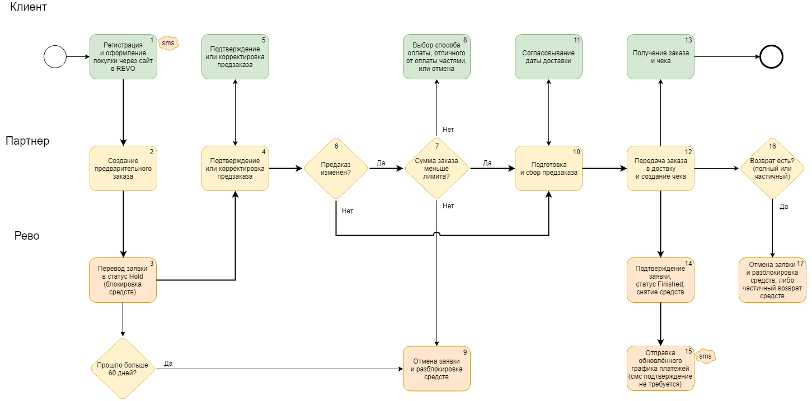

# Введение

API Factoring реализовано на протоколе HTTPS на основе JSON запросов.

Документация состоит из 4 основных частей:

* Описание авторизации, методов API и кодов ошибок.
* <a href="#db947828e5">Руководство по тестированию</a>.
* <a href="#6961794a3c">Описание возможных схем взаимодействия</a>.
* <a href="#guides">Руководство по реализации основных элементов</a>.

# Авторизация

## Базовые URL адреса

```javascript
BASE_URL = "https://r.revoplus.ru/"
BASE_URL = "https://demo.revoplus.ru/"
```

1. Для взаимодействия с сервисами Рево используются 2 базовых адреса:
 * https://r.revoplus.ru/ - адрес `production` сервиса.
 * https://demo.revoup.ru/ - адрес `demo` сервиса.
2. `BASE_URL` - переменная обозначающая базовый адрес.
3. ? http

## Параметры авторизации

> Пример параметров

```javascript
secret_key = "098f6bcd4621d373cade4e832627b4f6"
store_id = 12
```

1. На стороне Рево формируются уникальный идентификатор магазина и секретный ключ, которые передаются партнеру:
 * `store_id` - уникальный идентификатор магазина. Для одного партнера может быть сформировано несколько уникальных идентификаторов.
 * `secret_key` - секретный ключ, который используется при формировании электронно-цифровой подписи для аутентификации (проверки подлинности) параметров запроса с целью защиты формы от запуска сторонними лицами. Длина ключа от 8 байт. Алгоритм шифрования SHA1.
2. Для авторизации партнер отправляет `POST` запрос, используя <a href="#1c37860b3b">цифровую подпись</a> `signature` и уникальный идентификатор магазина `store_id`.
3. Примеры URL запросов можно посмотреть в разделе <a href="#api"> Методы API</a>.

## Принцип формирования цифровой подписи

> Алгоритм формирования цифровой подписи

```ruby
require 'digest/sha1'
secret_key = '098f6bcd4621d373cade4e832627b4f6'
data = "{\"callback_url\":\"https://shop.ru/revo/decision\",
\"redirect_url\":\"https://shop.ru/revo/redirect\",
\"current_order\":{\"sum\":\"7500.00\",\"order_id\":\"R001233\"},
\"primary_phone\":\"9268180621\"}"
signature = Digest::SHA1.hexdigest(data + secret_key)
```

```java
import java.io.UnsupportedEncodingException;
import java.security.MessageDigest;
import java.security.NoSuchAlgorithmException;
import java.util.Formatter;

public class Main {

    static String secret_key = "098f6bcd4621d373cade4e832627b4f6"; // Это пример
    static String data = "{\"callback_url\":\"https://shop.ru/revo/decision\",\"redirect_url\":\"https://shop.ru/revo/redirect\",\"current_order\":{\"sum\":\"7500.00\",\"order_id\":\"R001233\"},\"primary_phone\":\"9268180621\"}";

    public static void main(String[] args) {

        String signature = encryptPassword(data + secret_key); // Тут всегда будет 40 символов по SHA1
        System.out.println(signature);
    }

    private static String encryptPassword(String password) {
        String sha1 = "";
        try {
            MessageDigest crypt = MessageDigest.getInstance("SHA-1");
            crypt.reset();
            crypt.update(password.getBytes("UTF-8"));
            sha1 = byteToHex(crypt.digest());
        } catch(NoSuchAlgorithmException e) {
            e.printStackTrace();
        } catch(UnsupportedEncodingException e) {
            e.printStackTrace();
        }
        return sha1;
    }

    private static String byteToHex(final byte[] hash) {
        Formatter formatter = new Formatter();
        for (byte b : hash) {
            formatter.format("%02x", b);
        }
        String result = formatter.toString();
        formatter.close();
        return result;
    }
}
```

К строке `data` в формате json добавляется секретный ключ `secret_key`. К получившейся строке применяется алгоритм SHA1, в результате формируется цифровая подпись `signature`.

<aside class="notice">
Необходимо обратить внимание, что при формировании signature длина всегда будет 40 символов по SHA1.
</aside>

# Методы API

## Registration
<font color="green"> POST </font> `BASE_URL/factoring/v1/precheck/auth`

Метод предназначен для оформления заказа клиента и возвращает адрес `iframe_url`, с помощью которого вызывается форма Рево. В зависимости от информации, которая есть о пользователе в системе Рево, форма будет иметь различное число шагов:

* Если номер телефона клиента не найден в базе Рево (новый клиент), либо расчёт лимита ещё не производился, то форма будет состоять из 3 шагов: регистрации (расчёта лимита), аутентификации по смс и оформления заказа.
* Если номер телефона клиента найден в базе Рево (повторный клиент) и клиенту уже расчитан лимит, то форма будет состоять из 2 шагов: аутентификации по смс и оформления заказа.

<aside class="success">
Если клиент уже заполнял личные данные на сайте партнёра, их следует передать в запросе для автозаполнения соответствующих полей формы.
</aside>

В случае успешного оформления заказа, в ответе будет содержаться информация о графике платежей клиента - `schedule`.

??Как будет принято решение о выдаче лимита. ?? и что в ответе при этом ??

### Parameters

> Пример запроса в формате json

```jsonnet
{
  callback_url: "https://shop.ru/revo/decision",
  redirect_url: "https://shop.ru/revo/redirect",
  current_order:
  {
    order_id: "R001233",
    primary_phone: "9268180621",
    person:
    {
      first_name: "Петр",
      surname: "Чернышев",
      patronymic: "Александрович",
      birth_date: "15.01.1975",
      gender: "male"
    }
  }
}
```

 | |
-:|:-
**callback_url** <br> <font color="#939da3">string</font>	| URL для ответа от Рево по решению для клиента.
**redirect_url** <br> <font color="#939da3">string</font>	| URL для редиректа после нажатия на кнопку/ссылку в форме Рево "Вернуться в интернет магазин".
**current_order** <br> <font color="#939da3">object</font> | Объект, содержащий информацию о заказе.
**order_id** <br> <font color="#939da3">string</font> | Уникальный номер заказа. Не более 255 символов.
**primary_phone** <br> <font color="#939da3">integer, *optional*</font> | Номер телефона клиента 10 цифр (без кода страны).
**person** <br> <font color="#939da3">object, *optional*</font> | Объект, содержаий информацию о клиенте.
**first_name** <br> <font color="#939da3">string, *optional*</font> | Имя клиента.
**surname** <br> <font color="#939da3">object, *optional*</font> | Фамилия клиента.
**patronymic** <br> <font color="#939da3">object, *optional*</font> | Отчество клиента.
**birth_date** <br> <font color="#939da3">object, *optional*</font> | Дата рождения клиента в формате `dd.mm.yyyy`.
**gender** <br> <font color="#939da3">object, *optional*</font> | Пол клиента. Возможные значения: `male` или `female`.

В качестве `redirect_url` может выступать страница корзины. Можно вводить дополнительные проверки и перенаправлять пользователя на другие страницы в зависимости от ответа, полученного ранее на `callback_url`.

### Response Parameters

> Пример ответа при успешной аутентификации.

```jsonnet
{
  status: 0,
  message: "Payload valid",
  iframe_url: "https://r.revoplus.ru/form/v1/af45ef12f4233f"
}
```

> Пример ответа для успешного оформления товара

```jsonnet
{
  order_id: "R107356",
  decision: "approved",
  amount: "6700.00",
  term: 3,
  client:
  {
    primary_phone: "8880010203"
  },
  schedule:
  [{
    date: "01.01.2018",
    amount: "2933.33"
  },
  {
    date: "01.02.2018",
    amount: "2933.33"
  },
  {
    date: "01.03.2018",
    amount: "2933.33"
  }]
}
 ```

 | |
-:|:-
**status** <br> <font color="#939da3">integer</font> | Код ответа.
**message** <br> <font color="#939da3">string</font> | Короткое текстовое описание ответа.
**iframe_url** <br> <font color="#939da3">string</font>	| Cсылка на сгенерированный iFrame.
**order_id** <br> <font color="#939da3">string</font> | Уникальный номер заказа. Не более 255 символов.
**decision** <br> <font color="#939da3">string</font> | Решение по выдаче рассрочки. При положительном решении значение `approved`.
**amount** <br> <font color="#939da3">float</font> | Сумма в рублях с копейками.
**term** <br> <font color="#939da3">integer</font> | Срок рассрочки в месяцах.
**client** <br> <font color="#939da3">object</font> | Объект, содержащий информацию о клиенте.
**primary_phone** <br> <font color="#939da3">integer</font> | Номер телефона клиента 10 цифр (без кода страны).
**schedule** <br> <font color="#939da3">object</font> | Объект, содержащий информацию о графике платежей.
**date** <br> <font color="#939da3">string</font> | Дата платежа в формате `dd.mm.yyyy`.
**amount** <br> <font color="#939da3">float</font> | Сумма платежа в рублях с копейками.

## Precheck

<font color="green"> POST </font> `BASE_URL/factoring/v1/limit/auth`

Метод возвращает ссылку на iFrame с процедурой аутентификации клиента для получения лимита.

*?? Разница заключается лишь в том, что при вызове сервиса "Узнать лимит" в качестве суммы в API Рево передается 1 рубль, а при вызове сервиса пред оформления передается реальная сумма заказа. Названия параметров и формат данных указаны в подробных описаниях соответствующих блоков на схеме ниже. Также, для удобства последующей аналитики, вызовы сервиса "Узнать лимит" и сервиса предварительного оформления необходимо делать указывая разные виртуальные торговые точки (store_id).
API Рево позволяет сайту-партнеру Рево интегрировать на свой сайт iFrame (всплывающее окно), в котором открывается форма для взаимодействия с посетителем.
Для сервиса "Узнать лимит" возможен также более простой (но менее функциональный) способ интеграции, не требующий серверного программирования. Подробнее об этом способе можно прочитать тут: Сервис "Узнать лимит", упрощённая интеграция
??*

### Parameters

> Пример запроса в формате json

```jsonnet
{
  callback_url: "https://shop.ru/revo/decision",
  redirect_url: "https://shop.ru/revo/redirect",
  current_order:
  {
    amount: "6700.00",
    order_id: "R107356",
    valid_till: "21.04.2017 12:08:01+03:00"
  }
  primary_phone: "8880010203",
  skip_factoring_result: "false"
}
```

 | |
-:|:-
**callback_url** <br> <font color="#939da3">string</font>	| URL для ответа от Рево по решению для клиента.
**redirect_url** <br> <font color="#939da3">string</font>	| URL для редиректа после нажатия на кнопку/ссылку в форме Рево "Вернуться в интернет магазин".
**current_order** <br> <font color="#939da3">object</font> | Объект, содержащий информацию о заказе.
**amount** <br> <font color="#939da3">float</font> | Сумма в рублях с копейками.
**order_id** <br> <font color="#939da3">string</font> | Уникальный номер заказа. Не более 255 символов.
**valid_till** <br> <font color="#939da3">string</font> | Срок, в течении которого заказ считается актуальным (срок холдирования). По истечении срока заказ отменяется. Формат: `dd.mm.yyyy hh:mm:ss+hh:mm`, где после "+" указывается часовой пояс относительно GMT.
**primary_phone** <br> <font color="#939da3">integer</font> | Номер телефона клиента 10 цифр (без кода страны).
**skip_factoring_result** <br> <font color="#939da3">bool</font> | Флаг для определения, была ли осуществлена предоплата клиентом до вызова iFrame.

<aside class="notice">
Если корзина клиента пустая, в качестве order_id можно передать случайный уникальный guid (???).
</aside>

### Response Parameters

> Пример ответа для успешной аутентификации.

```jsonnet
{
  status: 0,
  message: "Payload valid",
  iframe_url: "https://r.revoplus.ru/form/v1/af45ef12f4233f"
}
```

 | |
-:|:-
**status** <br> <font color="#939da3">integer</font> | Код ответа.
**message** <br> <font color="#939da3">string</font> | Короткое текстовое описание ответа.
**iframe_url** <br> <font color="#939da3">string</font>	| Cсылка на сгенерированный iFrame.

## Status
<font color="green"> POST </font> `BASE_URL/factoring/v1/status`

Метод возвращает информацию по статусу заказа.

### Parameters

> Пример запроса в формате json

```jsonnet
{
  "order_id": "R107356"
}
```

 | |
-:|:-
**order_id** <br> <font color="#939da3">string</font> | Уникальный номер заказа. Не более 255 символов.

### Response Parameters

> Пример ответа, когда срок актуальности заказа ещё не вышел, решение по заказу (approved или declined) уже есть

```jsonnet
{
  status: 0,
  message: "Payload valid",
  current_order:
  {
    order_id: "R107356",
    expired: "false",
    decision: "approved",
    amount: "6700.00",
    discount_amount: "6100.00",
    term: 3
  }
}
```

> Пример ответа, когда срок актуальности заказа ещё не вышел, решения по займу нет (клиент не прошёл процесс до конца)

```jsonnet
{
  status: 0,
  message: "Payload valid",
  current_order:
  {
    order_id: "R107356",
    expired: "false"
  }
}
```

> Пример ответа, когда срок актуальности заказа истёк, решение по займу (Approve или declined) уже есть:

```jsonnet
{
  status: 0,
  message: "Payload valid",
  current_order:
  {
    order_id: "R107356",
    expired: "true",
    decision: "approved",
    amount: "6700.00",
    discount_amount: "6100.00",
    term: 3
  }
}
```

> Пример ответа, когда срок актуальности заказа истёк, решения по займу нет (клиент не прошел процесс до конца)

```jsonnet
{
  status: 0,
  message: "Payload valid",
  current_order:
  {
    order_id: "R107356",
    expired: "true"
  }
}
```

 | |
-:|:-
**status** <br> <font color="#939da3">integer</font> | Код ответа.
**message** <br> <font color="#939da3">string</font> | Короткое текстовое описание ответа.
**current_order** <br> <font color="#939da3">object</font> | Объект, содержащий информацию о заказе.
**order_id** <br> <font color="#939da3">string</font> | Уникальный номер заказа. Не более 255 символов.
**expired** <br> <font color="#939da3">bool</font> | Флаг, отображающий статус актуальности заказа. Для актуальных заказов значение `true`.
**decision** <br> <font color="#939da3">string</font> | Решение по выдаче рассрочки. При положительном решении значение `approved`.
**amount** <br> <font color="#939da3">float</font> | Сумма в рублях с копейками.
**discount_amount** <br> <font color="#939da3">bool</font> | ???
**term** <br> <font color="#939da3">float</font> | Срок рассрочки в месяцах.

## Finish

<font color="green"> POST </font> `BASE_URL/factoring/v1/precheck/finish`

Метод для финализации заказа путём передачи договора купли-продажи на обслуживание в Рево.

### Parameters

> Пример запроса в формате json

```jsonnet
{
  order_id: "R107356",
  amount: "6700.00",
  check_number: 'ZDDS3123F'
}
@FILES'check'
```

 | |
-:|:-
**order_id** <br> <font color="#939da3">string</font> | Уникальный номер заказа. Не более 255 символов.
**amount** <br> <font color="#939da3">float</font> | Сумма в рублях с копейками.
**check_number** <br> <font color="#939da3">string</font> | ???
**FILES'check'** <br> <font color="#939da3">path?</font> | Фискальный документ ???

### Response Parameters

???

## Cancel

<font color="green"> POST </font> `BASE_URL/factoring/v1/precheck/cancel`

Метод для отмены заказа. При отмене у клиента разблокируются ранее захолдированные средства.

### Parameters

> Пример запроса в формате json

```jsonnet
{
  order_id: "R107356",
}
```

 | |
-:|:-
**order_id** <br> <font color="#939da3">string</font> | Уникальный номер заказа. Не более 255 символов.

### Response Parameters

???

## Limit

<font color="green"> POST </font> `BASE_URL/api/external/v1/client/limit`

Метод для получения суммы лимита клиента по номеру его телефона. Метод работает для клиентов, оформивших хотя бы один займ в Рево или прошедших процедуру регистрации у партнера (?? а это какой метод ??).
Для новых клиентов получить информацию о лимите только по номеру телефона нельзя.

### Parameters

> Пример запроса в формате json

```jsonnet
{
  client:
  {
    mobile_phone: "9031234567"
  }
}
```

 | |
-:|:-
**client** <br> <font color="#939da3">object</font> | Объект, содержащий информацию о клиенте.
**mobile_phone** <br> <font color="#939da3">integer</font> | Номер телефона клиента 10 цифр (без кода страны).

### Response Parameters

> Пример ответа, когда клиент найден в базе

```jsonnet
{
    meta:
    {
      status: 0,
      message: "Payload valid"
    }
    client:
    {
      mobile_phone: "9031234567",
      limit_amount: "9500.00",
      status: "active"
    }
}
```

> Пример ответа, когда клиент найден в базе, но выдача займа невозможна

```jsonnet
{
    meta:
    {
      status: 0,
      message: "Payload valid"
    }
    client:
    {
      mobile_phone: "9031234567",
      limit_amount: "6700.00",
      status: "inactive"
    }
}
```

> Пример ответа, когда клиент не найден в базе

```jsonnet
{
    meta:
    {
      status: 0,
      message: "Payload valid"
    }
    client:
    {
      mobile_phone: "9031234567",
      limit_amount: "0.00",
      status: "new"
    }
}
```

 | |
-:|:-
**status** <br> <font color="#939da3">integer</font> | Код ответа.
**message** <br> <font color="#939da3">string</font> | Короткое текстовое описание ответа.
**client** <br> <font color="#939da3">object</font> | Объект, содержащий информацию о клиенте.
**mobile_phone** <br> <font color="#939da3">integer</font> | Номер телефона клиента 10 цифр (без кода страны).
**limit_amount** <br> <font color="#939da3">string</font> | ???
**status** <br> <font color="#939da3">string</font> | ???

## Return

<font color="green"> POST </font> `BASE_URL/factoring/v1/return`

Метод для осуществления процедуры возврата заказа.

### Parameters

> Пример запроса в формате json

```jsonnet
{
  order_id: "R001233",
  sum: "2010.00"
}
```

 | |
-:|:-
**order_id** <br> <font color="#939da3">string</font> | Уникальный номер заказа. Не более 255 символов.
**sum** <br> <font color="#939da3">float</font> | Сумма возврата в рублях с копейками. Возврат может быть частичным. Определение полного или частичного возврата происходит по суме автоматически.

### Response Parameters

> Пример ответа при успешной обработке запроса на возврат

```jsonnet
{
  status: "0",
  message: "Payload valid"
}
```

> Пример ответа при неуспешной обработке запроса на возврат

```jsonnet
{
  status: "10",
  message: "JSON decode error"
}
```

 | |
-:|:-
**status** <br> <font color="#939da3">integer</font> | Код ответа.
**message** <br> <font color="#939da3">string</font> | Короткое текстовое описание ответа.

# Коды ошибок

Код | Описание
-:|:-
**0**  | Payload valid
**10**  | JSON decode error
**20**  | Order `order_id` missing
**21**  | Wrong order `order_id` format
**22**  | Order exists
**24**  | Order with specified id not found
**30**  | Wrong order `order_sum` format
**40**  | Order `callback_url` missing
**32**  | Order amount is different from the amount specified before
**41**  | Order `redirect_url` missing
**50**  | Store id is missing
**51**  | Store not found
**60**  | `Signature` missing
**61**  | `Signature` wrong
**70**  | Phone number is different
**80**  | Unable to finish - order is already finished/canceled
**81**  | Unable to cancel - order is already finished/canceled
**100** | At the moment the server cannot process your request

# Тестирование и отладка

Тестирование и отладка интеграции производятся на demo сервере (https://demo.revoplus.ru). При заполнении номера телефона в анкете рекомендуется использовать несуществующий префикс оператора 888, чтобы sms сообщения не отправлялись реальным людям. На production сервере использовать такой префикс нельзя.

Все коды подтверждения и пин-коды `8888`.

# Схемы взаимодействия

Возможны следующие схемы взаимодействия:

<table border="0" align="center">
  <tr>
    <th rowspan="2">Схема</th>
    <th colspan="3" align="center">Предоплата</th>
    <th rowspan="2">Изменение заказа</th>
  </tr>
  <tr>
    <th>Партнёр</th>
    <th>Рево</th>
    <th>Отсутствует</th>
  </tr>
  <tr>
    <td>Факторинг 1</td>
    <td>х</td>
    <td></td>
    <td></td>
    <td>х</td>
  </tr>
  <tr>
    <td>Факторинг 2</td>
    <td></td>
    <td>x</td>
    <td></td>
    <td>х</td>
  </tr>
  <tr>
    <td><a href="http://localhost:4567/#3">Факторинг 3</a></td>
    <td></td>
    <td></td>
    <td>x</td>
    <td>х</td>
  </tr>
  <tr>
    <td>Факторинг 4</td>
    <td>х</td>
    <td></td>
    <td></td>
    <td></td>
  </tr>
  <tr>
    <td>Факторинг 5</td>
    <td></td>
    <td>x</td>
    <td></td>
    <td></td>
  </tr>
  <tr>
    <td>Факторинг 6</td>
    <td></td>
    <td></td>
    <td>x</td>
    <td></td>
  </tr>
</table>

## Факторинг 1

## Факторинг 2

## Факторинг 3

Клиент оформляет покупку на сайте партнёра и выбирает способ оплаты "оплата частями РЕВО". Дальнейшее оформление происходит в поп-апе, ссылка на который получается с помощью метода <a href="#registration">Registration</a>.

На стороне партнёра формируется предварительный заказ



## Факторинг 4

## Факторинг 5

## Факторинг 6

# Guides

## Регистрация пользователя
